# Introduction
Live chat controller is code for control your pc(window only) with live chat on youtube/discord/twitch

# Features
- get chat from youtube/discord/twitch/facebook live chat and control pc
- custom setting command
- record and set input Macro for new command
- local website UI for easier interaction and monitor (next release)

# บทนำ
Live chat controller คือ โปรแกรมควบคุมคอม โดยดึงคำสั่งจาก live chat บน youtube/discord/twitch

# สิ่งที่ทำได้
- ดึงข้อมูลจาก youtube/discord/twitch/facebook chat มาทำงาน
- แก้ไข/ตั้งรูปแบบคำสั่งเอง
- บันทึก และ ตั้ง Macro ให้เป็นคำสั่งใหม่
- มี local Web UI ทำให้ติดต่อ และ สังเกตุการทำงานได้ง่ายขึ้น (ยังไม่เสร็จ)

# How to use
### When launch software you will see home screen.
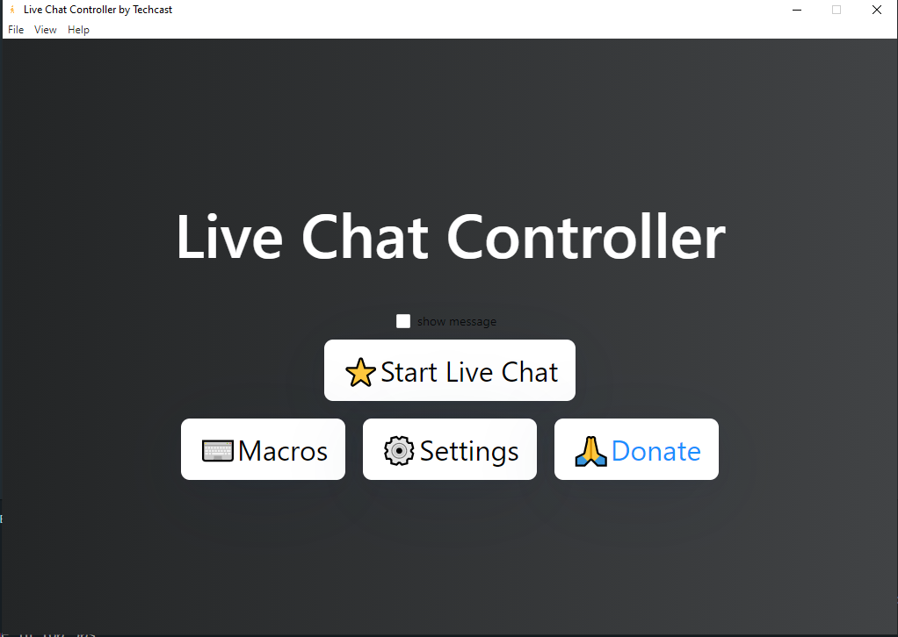

### First thing you have to do is set source of your channel
- Youtube setting example
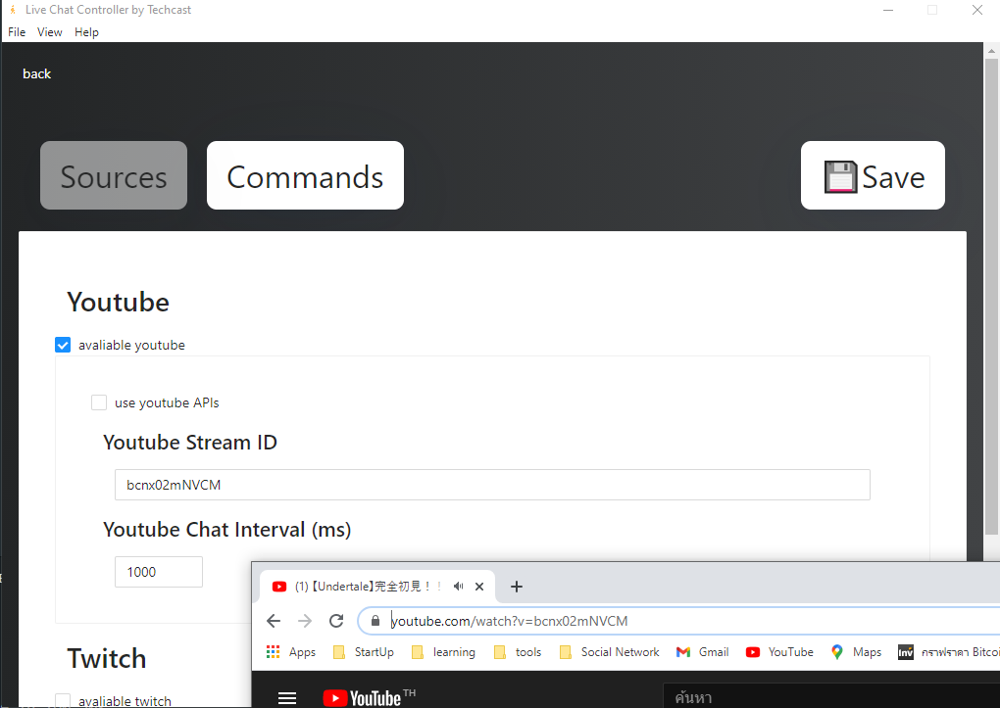

- Twitch setting example
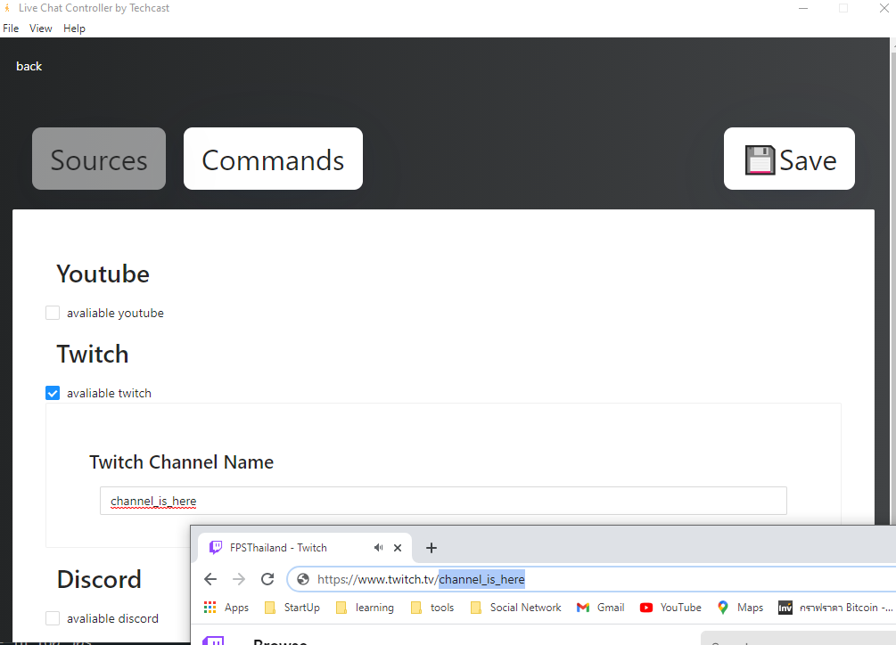

- Discord setting example
    - Go to Discord Developer Site
    - Create Bot!!
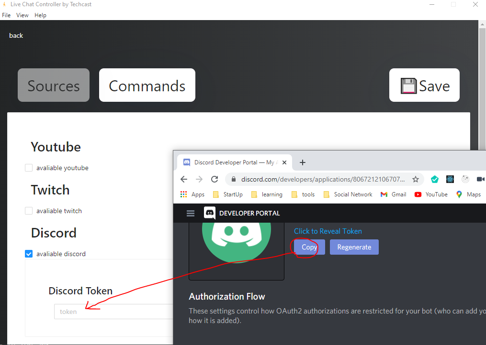

- Facebook setting example
    - Where do i find access_token?
        - from facebook developer (https://developers.facebook.com/)
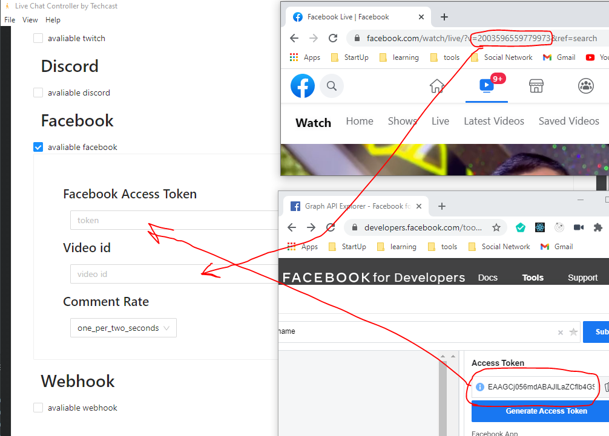

- Webhook setting example <b>(this is not source but send message to other server)</b>
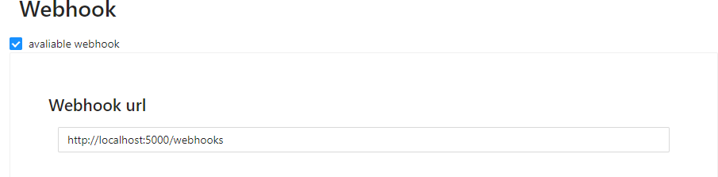

### Command Setting
command is action for you computer, words is messages for chat that 100% match to do action (don't forget to save settings)
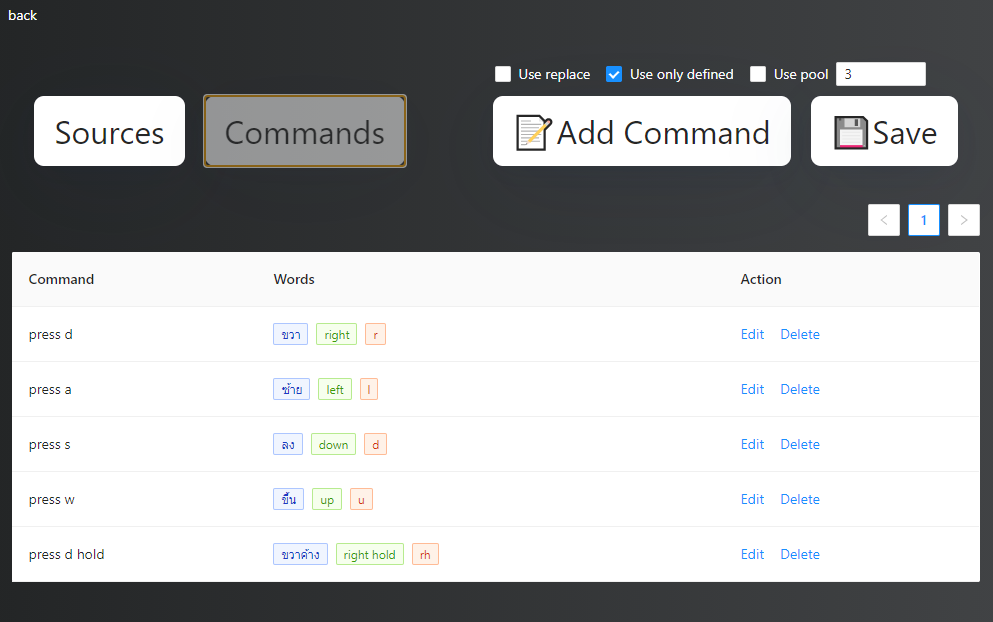

### Macro
record macro (press f6 or click button)
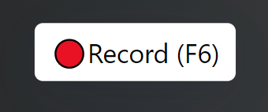

stop record macro (press esc)
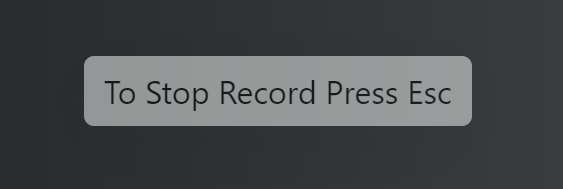

when finish record you will see random macro name happen.
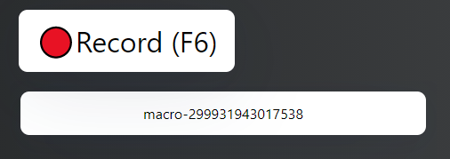

hover it. To see options.
options
- play (left)
- rename (middle)
- delete (right)

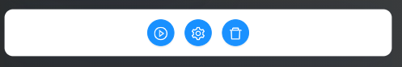

you can make your macro as action
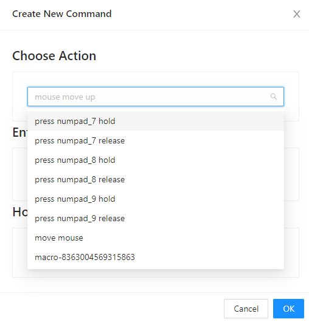

### setting options
- <b>use replace</b> is replace word to other.
    - for example. command1 = go, word1 = g and command2 = here, word2 = h
    - when you get message "g h". it will replace "g h" to "go here"
    - REMEMBER you have to split it with space. if you send message as "gh", it will do nothing.
- <b>use only defined</b> is allow only words that is on commands setting
    - if not use only defined you can full control by message like "press a" to make you pc press a key
    - but if you don't want someone to prank you then select use only defined
- <b>use pool</b> is do action when message is reach the limit.
    - if you set use pool and set it as 3 = action will do when 100% same message is found for 3 times.
    - you can set it seperately, when create commands.
    - this is you full when your live have many viewer and chat